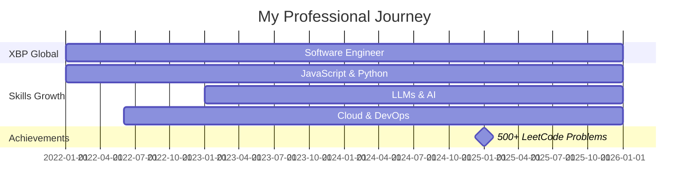

# Hey there! 👋 I'm a Software Engineer at XBP Global

<div align="center">
  
[](https://git.io/typing-svg)

</div>

---

## 🚀 About Me

I'm a passionate **Software Engineer** at **XBP Global** with **3+ years of experience** building scalable applications and working with cutting-edge technologies. I specialize in **LLMs, agentic workflows**, and full-stack development.

- 🤖 Building intelligent systems with **LLMs** and **agentic workflows**
- 💻 Crafting robust backends and interactive frontends
- ☁️ Deploying scalable solutions on **Azure** with **Docker** & **Kubernetes**
- 🧠 Solved **500+ problems** on LeetCode
- 🌱 Always learning and exploring new technologies

---

## 💪 Skill Proficiency

<div align="center">

### 🏆 Proficient (Expert Level)


```
JavaScript  ████████████████████  100%
Python      ████████████████████  100%
FastAPI     ████████████████████  100%
```

### ⭐ Good (Advanced Level)


```
React       ████████████████░░░░  80%
Docker      ████████████████░░░░  80%
Kubernetes  ████████████████░░░░  80%
```

### 🛠️ Additional Technologies


</div>

---

## 🎯 Expertise Areas

<table>
<tr>
<td width="50%">

### 🤖 AI & LLMs
- Large Language Models Integration
- Agentic Workflow Design
- Prompt Engineering
- AI-Powered Applications

</td>
<td width="50%">

### 🏗️ Backend Development
- RESTful API Design
- FastAPI & Node.js
- Microservices Architecture
- Database Design & Optimization

</td>
</tr>
<tr>
<td width="50%">

### 🎨 Frontend Development
- React & Modern JavaScript
- Responsive Design
- State Management
- UI/UX Implementation

</td>
<td width="50%">

### ☁️ DevOps & Cloud
- Docker Containerization
- Kubernetes Orchestration
- Azure Cloud Services
- CI/CD Pipelines

</td>
</tr>
</table>

<!-- --- -->

<!-- ## 📊 GitHub Stats

<div align="center">


</div> -->

---

## 🏅 LeetCode Stats

<div align="center">


### 🎯 500+ Problems Solved!


</div>

---

## 🔥 Current Focus

```javascript
const currentFocus = {
    role: "Software Engineer @ XBP Global",
    specialization: ["LLMs", "Agentic Workflows", "Full Stack Development"],
    learning: ["Advanced AI/ML", "System Design", "Cloud Architecture"],
    goals: ["Build more AI-powered solutions", "Contribute to open source", "Master distributed systems"]
};
```

---

## 📈 Experience Timeline



---

## 🛠️ Tech Stack

<div align="center">

| Category | Technologies |
|----------|-------------|
| **Languages** | JavaScript, Python, TypeScript |
| **Frontend** | React, HTML5, CSS3, Redux |
| **Backend** | FastAPI, Node.js, Express.js |
| **AI/ML** | LLMs, OpenAI, LangChain, Agentic Workflows |
| **DevOps** | Docker, Kubernetes, CI/CD, GitHub Actions |
| **Cloud** | Azure, Azure Functions, Azure DevOps |
| **Databases** | MongoDB, PostgreSQL, Redis |
| **Tools** | Git, VS Code, Postman, Jira |

</div>

---

## 🌟 Highlights

<div align="center">

🎓 **3+ Years** of Professional Experience

🏢 Currently at **XBP Global**

🤖 Specialized in **LLM & Agentic Workflows**

💡 **500+ LeetCode** Problems Solved

☁️ **Cloud Native** Development Expert

🚀 **Full Stack** Developer

</div>

---

## 📫 Let's Connect!

<div align="center">

[](https://linkedin.com/in/YOUR_LINKEDIN)
[](https://github.com/YOUR_GITHUB)
[](https://leetcode.com/YOUR_LEETCODE)
[](mailto:YOUR_EMAIL)

</div>

---

<div align="center">

### 💭 Quote of the Day


---

### 👀 Profile Views


---

⭐️ From [YOUR_NAME](https://github.com/YOUR_GITHUB_USERNAME)

**"Building the future, one line of code at a time."** 💻✨

</div>